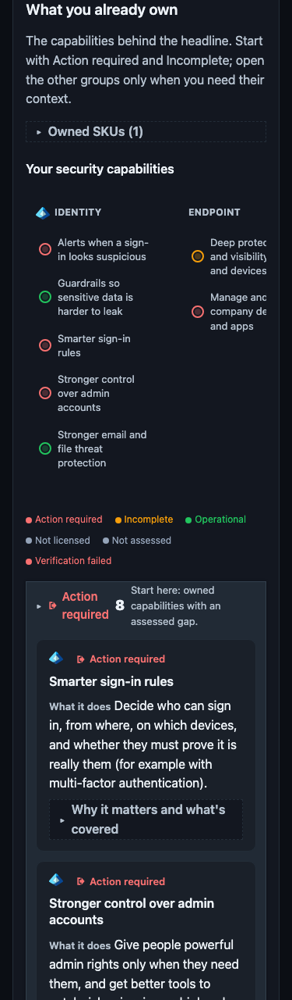

# Security License Lens

**The security you already own (and ignore).**

You pay for E5, Entra ID P2, Defender, and related SKUs. A lot of the useful
controls in those SKUs never get turned on. LicenseLens maps what you own to
the controls that should be on, then reports the gaps: you pay for X, we
expected Y, we observed Z.

CLI: `licenselens` · Requires Python 3.12+

> Documentation: [d4rk-pri0r.github.io/licenselens](https://d4rk-pri0r.github.io/licenselens/)


## Quick start

```bash
# One-command offline demo → HTML report (macOS / Linux / Windows)
pipx install licenselens
licenselens demo

# Interactive scan: prompts for anything missing (TTY)
licenselens scan

# Or jump straight to a live tenant walkthrough
licenselens quickstart
```

On Windows, the PyPI wheel bundles the PowerShell collector bridge since
0.4.0 (shipping in the 0.4.0 release; PyPI latest is 0.3.0 until it is
published — see [Releases](docs/releases.md)), so the email pack and all
PowerShell-only collectors run from a plain pipx install — see the
[Windows guide](docs/windows.md) (requires Python 3.12+ and pipx).

Contributors: see [CONTRIBUTING.md](CONTRIBUTING.md) for the development setup.

In a terminal, `licenselens scan` asks demo vs live tenant, sign-in method, and
other missing options. Flags and `AZURE_*` env vars always win when set.
Non-interactive environments default to dry-run (or exit with a clear error on
`--live` without credentials).

Default priority packs are **identity + endpoint**. They shape the headline rollup and top actions; enabled checks still evaluate unless `--workload` filters them. Email policy config is not readable via Graph (PowerShell-only); use `--allow-email-proxy` only if you explicitly want a labeled Secure Score degraded path.

### Live / MSP

```bash
licenselens doctor --live --auth client_secret
licenselens scan --live --auth client_secret -o reports
licenselens batch tenants.yaml -o reports
```

## What it looks like

One HTML file with posture, entitlements, ranked gaps, and an explore view of
every assessed control. It runs with JavaScript off and does not make network
requests.


*What you own, what's working, and what to fix first.*


*Each finding includes evidence and a link to the admin page.*

<p align="center">
  
  <br>
  <em>The same report at mobile width.</em>
</p>

## A concrete example

The most common finding, `id-ca-priv-gaps`:

- **You pay for** Microsoft 365 E5, so Conditional Access is licensed for every user.
- **We expect** MFA and legacy-auth blocking enforced through a CA policy.
- **We observed** zero Conditional Access policies → the report marks the tenant `EXPOSED`.
- **Do this** → enable an MFA CA policy (a few hours of work). The gap closes on the next scan.

## Why Security License Lens?

| Tool | Optimizes for |
|------|----------------|
| [ScubaGear](https://github.com/cisagov/ScubaGear) | CISA baseline compliance |
| [Maester](https://github.com/maester365/maester) | Continuous config tests (Pester) |
| [Monkey365](https://github.com/silverhack/monkey365) | Broad CSPM / CIS-style assessment |
| Microsoft Secure Score | Score + recommendations (not SKU-gated) |
| License waste scripts | Seat assignment efficiency |
| **Security License Lens** | **Owned SKUs → expected high-value controls → unused/default gaps** |

### Diff, discovery, and batch

```bash
# Compare two scan JSON artifacts by check_id
licenselens diff reports/before.json reports/after.json -o reports/diff.md

# Discover Sentinel-capable workspaces (prints ARM resource IDs)
licenselens discover-workspace --auth client_secret

# Multi-tenant scans from tenants.yaml (per-tenant reports + index.md)
licenselens batch tenants.yaml -o reports
```

## Full check pack (v0.4.0)

**166 checks** · **31 capabilities** · **11 profiles** · **135** pinned SCuBA coverage rows · package/sample **0.4.0**

Checks run as **direct**, **proxy**, **manual** (you confirm), or **dynamic**
(direct first, Secure Score only if direct is missing). The report still records
whether a dynamic check ended up `direct` or `proxy`.

The authoritative pack lives in the generated reference (do not maintain a partial public table here):

- [Check reference](docs/reference/checks.md) — collector, support state, evaluator, capabilities, evidence keys
- [Capabilities](docs/reference/capabilities.md) · [Profiles](docs/reference/profiles.md) · [Permissions](docs/reference/permissions.md) · [Coverage](docs/reference/coverage.md)
- Machine-readable: [docs/reference/reference.json](docs/reference/reference.json) · [manifest.json](docs/reference/manifest.json)

Unlicensed capabilities report `not_licensed` instead of false gaps.

### Known limitations

See [docs/limitations.md](docs/limitations.md) for the full list. Short version:

- **Email pack off by default** — no Graph API for MDO policy config (PowerShell-only); `--allow-email-proxy` is opt-in and labeled (dynamic / Secure Score path)
- Some surfaces are **manual** (operator-confirmed) or **proxy** (Secure Score); see the check reference for per-check state
- Sentinel needs a **workspace ARM ID** + Azure RBAC
- Sign-in / MDE inventories may **truncate** on huge tenants
- Findings are **advisory**, not a compliance certification
- **No product telemetry** by default

## Architecture

```
SKUs / service plans → capability catalog → eligible checks
        → collectors (Graph / MDE / ARM) → findings → HTML / JSON / Markdown
```

## Permissions

See [docs/permissions.md](docs/permissions.md) and [docs/app-registration.md](docs/app-registration.md).

### Exit codes

| Code | Meaning |
|------|---------|
| 0 | Success (no gap/partial findings) |
| 1 | Completed with gap or partial findings |
| 2 | Auth / configuration / API error |

## Contributing

See [CONTRIBUTING.md](CONTRIBUTING.md) and [docs/adding-a-check.md](docs/adding-a-check.md).

## Security

[SECURITY.md](SECURITY.md) — read-only, no telemetry by default.

## License

[MIT](LICENSE)

## Disclaimer

Security License Lens is an independent open-source project and is **not** affiliated with, endorsed by, or sponsored by Microsoft Corporation. Findings are advisory. “Microsoft”, “Entra”, “Defender”, “Sentinel”, and “Purview” are trademarks of their respective owners.
