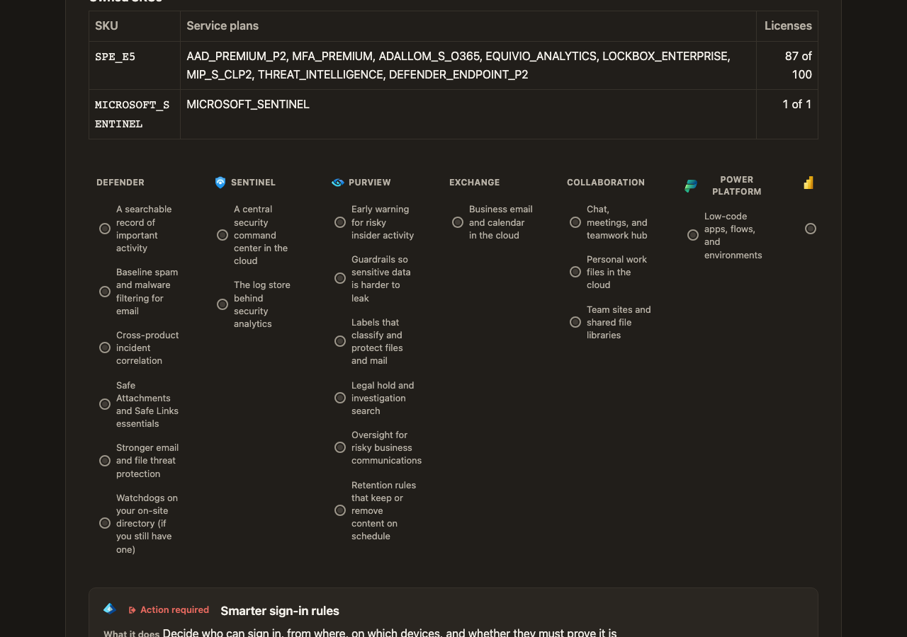
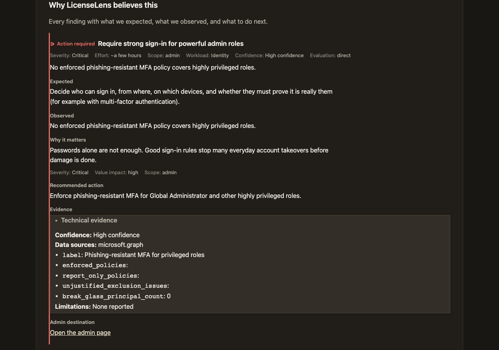

---
hide:
  - navigation
  - toc
---

# Security License Lens

**The security you already own (and ignore).**

LicenseLens turns your Microsoft 365 entitlements into a plain-English,
prioritized fix list: it checks whether the controls you already pay for are
actually on, and shows you what to fix first.

Security License Lens finds **Microsoft security configuration debt**:
high-value capabilities in E5, Entra ID P2, Defender, and related SKUs that stay
at default or unused. It starts from **owned entitlements**, maps them to
expected controls, and reports gaps as *you pay for X → expected Y → observed Z*.

-   :material-rocket-launch-outline: **Quick start**

    ---

    Install, run the offline demo, and produce your first report in minutes.

    [:octicons-arrow-right-24: Get started](getting-started.md)

-   :material-security: **How it works**

    ---

    Entitlements, capabilities, checks, findings, and exit codes.

    [:octicons-arrow-right-24: Read the concepts](concepts.md)

-   :material-key-outline: **Live scans**

    ---

    App registration, auth modes, and the MSP batch workflow.

    [:octicons-arrow-right-24: Set up authentication](app-registration.md)

-   :material-shield-check-outline: **The check pack**

    ---

    140 declarative checks across identity, email, endpoint, and more.

    [:octicons-arrow-right-24: Browse the checks](checks.md)

## What it looks like

The report is a dark, offline-first dashboard — "Warm Charcoal" — that opens
with a signature animated sequence: your org identity, a count-up posture
figure, a radial gauge, and the top actions, all landing in under a second.
Then the calm, five-section read begins: where you stand, what you're paying
for, what matters most, and why LicenseLens believes each finding. Branded
Microsoft workload icons sit beside every capability and chart label, and the
whole report renders with JavaScript disabled and no network at all.

Every finding shows its evidence and a direct link to the admin page.

The same report is fully responsive and works offline at mobile width.

## The most common finding

`id-ca-priv-gaps`:

- **You pay for** Microsoft 365 E5, so Conditional Access is licensed for every user.
- **We expect** MFA and legacy-auth blocking enforced through a CA policy.
- **We observed** zero Conditional Access policies → the report marks the tenant `EXPOSED`.
- **Do this** → enable an MFA CA policy. The gap closes on the next scan.

## Why Security License Lens?

| Tool | Optimizes for |
|------|----------------|
| [ScubaGear](https://github.com/cisagov/ScubaGear) | CISA baseline compliance |
| [Maester](https://github.com/maester365/maester) | Continuous config tests (Pester) |
| [Monkey365](https://github.com/silverhack/monkey365) | Broad CSPM / CIS-style assessment |
| Microsoft Secure Score | Score + recommendations (not SKU-gated) |
| License waste scripts | Seat assignment efficiency |
| **Security License Lens** | **Owned SKUs → expected high-value controls → unused/default gaps** |

[:material-book-open-page-variant-outline: Full comparison](comparison.md) ·
[:material-github: Source on GitHub](https://github.com/d4rk-pri0r/licenselens)
